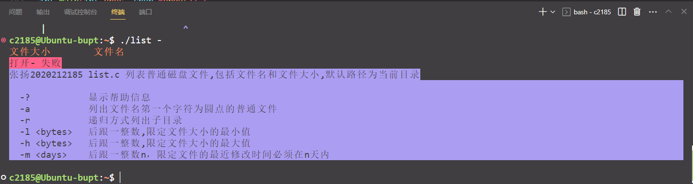
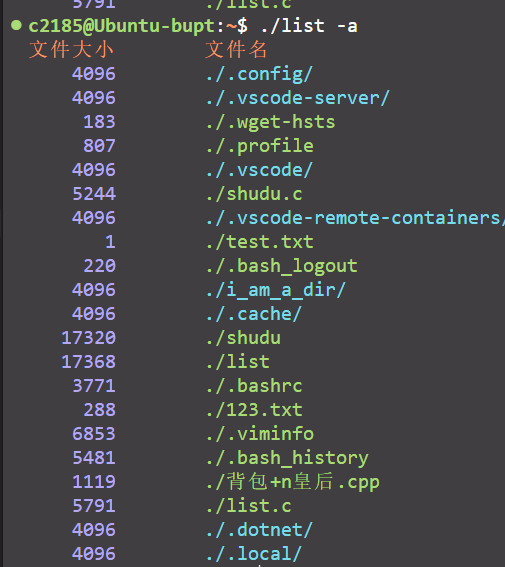
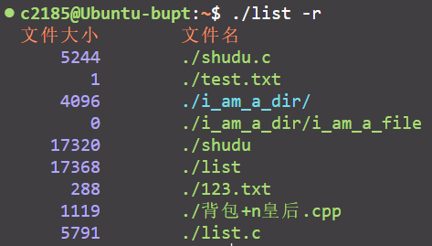
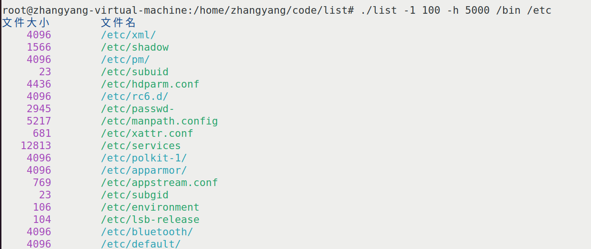
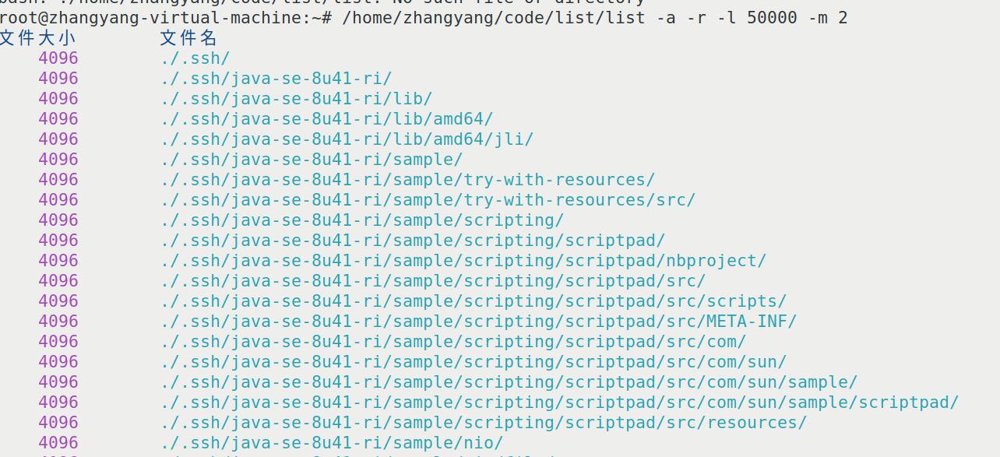
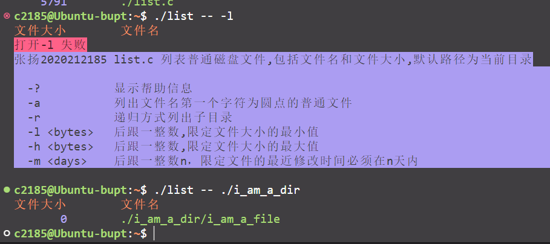
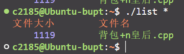

# Linux上机作业2

------

**基本要求**
编程实现程序`list.c`，列表普通磁盘文件，包括文件名和文件大小。

(1）使用`vi`编辑文件，熟悉工具vi。
(2）使用Linux的系统调用和库函数。
(3）体会Shell**文件通配符**的处理方式以及命令对选项的处理方式。

对选项的处理，自行编程逐个分析命令行参数。不考虑多选项挤在一个命令行参数内的情况。

**处理对象和选项**
`ls`命令类似,处理对象可以有0到多个
**0个**:列出当前目录下所有文件（**不含点打头的**文件，如`.profile`)
**普通文件**:列出文件
**目录**:列出目录下所有文件

实现自定义选项`r`,`a`, `l`,`h`,`m`以及`--`
`-r`递归方式列出子目录（每项要含路径，类似`find`的`-print`输出风格，需要设计**递归程序**)
`-a`列出文件名第一个字符为**圆点**的普通文件（默认情况下不列出文件名首字符为圆点的文件)
`-l`后跟一整数,限定文件**大小的最小值**（字节)
`-h`后跟一整数,限定文件**大小的最大值**（字节)
`-m`后跟一整数`n`，限定文件的**最近修改时间**必须在`n`天内
`--`显式地**终止命令选项分析**

------

[TOC]

## 一、编写`analyse_parameter()`函数

首先定义并初始化储存参数信息的结构体

```c
struct para { //0表示未使用，1表示使用
	int r; 
	int a;
	int l;
	int h;
	int m;
	int min; //文件大小最小值
	int max; //文件大小最大值
	int day; //修改天数
}Parameter = {0, 0, 0, 0, 0, -1, -1, -1}; //初始化
```

实现了自定义选项`r`,`a`, `l`,`h`,`m`以及`--`

从`main`函数中的`int argc, char argv[]`获得参数内容。

之后遍历并分析参数，详见**注释**

```c
//遍历参数
for (int i = 1; i < argc; i++) {
    if (strcmp(argv[i], "-r") == 0) {
    Parameter.r = 1; //有-r参数
}
else if (strcmp(argv[i], "-a") == 0) {
    Parameter.a = 1; //有-a参数
}
else if (strcmp(argv[i], "-l") == 0) {
    Parameter.l = 1; //有-l参数
    i++; //下一个参数是最小值
    Parameter.min = atoi(argv[i]); //转换为整数保存
}
else if (strcmp(argv[i], "-h") == 0) {
    Parameter.h = 1;//有-h参数
    i++; //下一个参数是最大值
    Parameter.max = atoi(argv[i]);//转换为整数保存
}
else if (strcmp(argv[i], "-m") == 0) {
    Parameter.m = 1;// 有-m参数
    i++; // 下一个参数是天数
    Parameter.day = atoi(argv[i]); //转换为整数保存
}
else if (strcmp(argv[i], "--") == 0) { //--标记参数结束
    i++; //下一个参数是路径
    if (i == argc) strcpy(path, "."); //如果没有路径，使用当前目录
    else if (i = argc - 1) strcpy(path, argv[i]); //如果有路径，保存路径
    else error(); //参数错误
    break; //参数结束
}
else if (i = argc - 1) {
	strcpy(path, argv[i]); //如果没有--标记，最后一个参数是路径
}
else {
	error(); //参数错误
}
```


## 二、编写`print_file_info()`函数

**读取并打印文件信息**

### 1.头文件中的接口

先了解`<sys/stat.h>`头文件中的`stat`数据结构

```c
struct stat { 
    dev_t st_dev; // 文件所在设备ID 
    ino_t st_ino; // 结点(inode)编号  
    mode_t st_mode; // 保护模式 
    nlink_t st_nlink; // 硬链接个数  
    uid_t st_uid; // 所有者用户ID  
    gid_t st_gid; // 所有者组ID  
    dev_t st_rdev; // 设备ID(如果是特殊文件) 
    off_t st_size; // 总体尺寸，以字节为单位 
    blksize_t st_blksize; // 文件系统 I/O 块大小
    blkcnt_t st_blocks; // 已分配的 512B 块个数
    time_t st_atime; // 上次访问时间 
    time_t st_mtime; // 上次更新时间 
    time_t st_ctime; // 上次状态更改时间 
};
```

主要函数有

```c
int stat(const char *restrict pathname, struct stat *restrict buf);
int fstat(int fields, struct stat *buf);
int lstat(const char *restrict pathname, struct stat *restrict buf);
```

其中`stat`函数的作用是获取路径名 `path` 对应的 `inode` 中的属性

`<sys/stat.h>`中提供了宏`S_ISDIR(info.st_mode)`来判断文件**是不是目录**

### 2.获取文件状态

获取文件状态并储存在`stbuf`结构中，采用终端转义字符`\033[31m`来输出红色的无法打开文件的消息

```c
// 获取文件状态并储存在stbuf结构中
if (stat(name, &stbuf) == -1) { //
    fprintf(stderr, "\033[31;41m打开%s 失败\033[0m\n", name); //打开文件失败
    error();
    return;
}
```

然后采用`if (S_ISDIR(stbuf.st_mode))`判断文件**是不是目录**

### 3.该文件是目录

先判断是不是**当前目录**，不是当前目录，**打印目录名**

利用**终端转义字符**，将**文件大小**打印为**紫色**，将**目录名**打印为**深绿色**

```c
//如果是目录，根据-r打印目录size及name
if (strcmp(name, path) != 0)
    printf("\033[35m%8ld\033[0m\t\033[36m%s/\033[0m\n", stbuf.st_size, name); //不是当前目录，打印目录名
```

然后根据参数`-r`决定是否遍历下一级目录

如果有参数`-r`或者**是当前目录的话**，调用`read_dir()`，读取目录中的内容

```c
if (Parameter.r == 1 || strcmp(name, path) == 0) { //如果有 -r 遍历下一级目录
    read_dir(name, print_result);
}
```

### 4.该文件不是目录

不是目录，根据-l -h -m打印文件size及name

设置一个`flag`，判断是否要输出

有参数`-l` ，`stbuf.st_size < Parameter.min`, 不满足条件,不输出

有参数`-h` ，`stbuf.st_size < Parameter.min`, 不满足条件,不输出

有参数`-m`，根据修改是时间判断是否输出

如果满足条件，打印文件大小和文件名

利用**终端转义字符**，将**文件大小**打印为**紫色**，将**文件名**打印为**绿色**

```c
//不是目录，根据-l -h -m打印文件size及name
int flag = 1; //判断是否要输出 
if (Parameter.l == 1 && stbuf.st_size < Parameter.min) flag = 0; //不满足条件
if (Parameter.h == 1 && stbuf.st_size > Parameter.max) flag = 0; 
if (Parameter.m == 1) { 	//判断文件修改时间
    struct timeval nowTime; //当前时间
    gettimeofday(&nowTime, NULL); //获取当前时间
    if (nowTime.tv_sec - stbuf.st_mtim.tv_sec > (time_t)(Parameter.day*86400)) 	//判断是否超过指定天数
        flag = 0; //不满足条件
}
if (flag == 1) 
    printf("\033[35m%8ld\033[0m\t\033[32m%s\n\033[0m", stbuf.st_size, name); //满足条件，打印文件大小和文件名
```


## 三、编写`read_dir()`函数，读取目录

```c
void read_dir(char *dir, void (*func)(char *)); //读目录
```

对目录中所有文件执行`print_result`操作

把`print_result`函数作为参数传进去

### 打开目录失败

采用终端转义字符`\033[31m`来输出红色的无法打开路径的消息

```c
if ((dfd = opendir(dir)) == NULL) {
		fprintf(stderr, "\033[31mread_dir:无法打开%s\033[0m\n", dir); // 打开目录失败
		return; 
	}
```
### 打开目录成功

先**跳过当前目录`.`以及父目录`..`**,然后判断**文件名是否过长**，之后根据参数`-a`决定是否打印`.`开头的文件，然后**拼接文件名**，作为参数传入打印文件信息的函数`print_result`中。

```c
while ((dp = readdir(dfd)) != NULL) { //读目录记录项
    if (strcmp(dp->d_name, ".") == 0 || strcmp(dp -> d_name, "..") == 0) {
        continue;  //跳过当前目录以及父目录
    }

    if (strlen(dir) + strlen(dp -> d_name) + 2 > sizeof(name)) {
        fprintf(stderr, "\033[31mread_dir : 文件名 %s %s 太长\033[0m\n", dir, dp->d_name); //文件名过长
    }
    else {
        if (dp->d_name[0] == '.' && Parameter.a == 0) //以.开头的文件 
            continue;
        sprintf(name, "%s/%s", dir, dp->d_name); //拼接文件名
        (*func)(name); //执行函数print_result
    }
}
```

## 四、测试

### 打印错误和帮助信息




### `-a`列出原点文件

```shell
./list -a
```



### `-r`递归打印文件

```shell
./list -r
```



### `-l`和`-h`限制文件大小

```shell
 ./list -l 100 -h 5000
```



由于ssh学校服务器没有root权限，这个命令我在自己的虚拟机上测试

### `-m`限制修改日期

```shell
./list -a -r -l 50000 -m 2
```

递归式列出当前目录树下大小超50KB且2天内修改过的文件（包括文件名首字符为圆点的文件)



### `--`结束参数

```shell
./list  -- -l
./list  -- ./i_am_a_dir
```



### `./list *`


